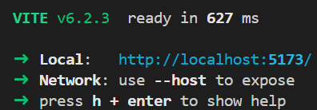

# カウンター

## 目次

- [概要](#概要)
- [機能](#機能)
- [使い方](#使い方)

## 概要

<a name="概要"></a>

シンプルなカウンターアプリです。

## 機能

<a name="機能"></a>

- カウントアップ
- カウントダウン
- カウンターの追加
- カウンターの削除
- 保存

## 使い方

<a name="使い方"></a>

1. gitからコピー  
    windows

    ```ps1
    git clone https://github.com/mana0707/counter.git
    ```

2. viteを起動

    ```ps1
    npx vite
    ```

3. Localに表示されているURLにアクセス  
    
